# AI气象灾害预警功能PRD文档

---

## 一、业务背景

随着现代农业的快速发展，精准农业和智慧农业成为行业趋势。农业生产对气象信息的依赖程度越来越高，特别是对气象灾害的预警和应对能力，直接影响农作物的产量和质量。

### 1.1 业务痛点

传统的气象信息服务存在以下痛点：

- **信息分散**：气象信息分散在各个平台，农户需要多个渠道获取信息
- **缺乏针对性**：通用气象信息无法满足不同地块、不同作物的个性化需求
- **预警不及时**：预警信息传递滞后，农户无法及时采取应对措施
- **决策支持不足**：仅有气象数据，缺乏基于地块和作物的农事决策建议

### 1.2 解决方案

基于云农谷自研大模型的AI农业专家系统，通过整合气象数据、地块信息、作物生长阶段等多维度数据，为农户提供**地块级精准气象预警**和**智能农事决策建议**，帮助农户提前预防气象灾害，优化农事安排，降低生产风险，提高农业收益。

---

## 二、本期需求范围（功能清单）

| 功能编号 | 功能名称 | 功能描述 | 优先级 |
|:--------:|:--------|:--------|:------:|
| F001 | AI对话快速访问入口 | 在AI对话页面提供"气象灾害预警"和"地块灾害预警"两个快速访问卡片，用户可快速进入对应功能 | P0 |
| F002 | 气象灾害预警主页（气象简报智能体入口） | 气象简报智能体的入口页面，提供AI欢迎语、输入框、快速访问智能体入口，用户可在此开始与气象灾害预警AI专家对话 | P0 |
| F003 | 地块气象灾害预报智能体（核心智能体） | 核心智能体页面，自动获取用户位置或支持手动选择地块，提供地块级气象预报和对话交互，生成气象简报卡片 | P0 |
| F004 | 位置获取与授权 | 支持GPS定位获取用户位置，自动匹配地块；定位失败时引导用户授权或手动选择 | P0 |
| F005 | 地块选择功能 | 当定位失败或用户位置不在任何地块范围内时，提供地块列表供用户手动选择 | P0 |
| F006 | 气象简报卡片展示 | 以卡片形式展示地块气象信息，包括：红绿灯状态、地块信息、当前天气、预警信息、关联地块 | P0 |
| F007 | 气象详情页面 | 点击简报卡片中的"地块气象灾害预报"按钮，跳转到详情页，展示完整的气象分析报告 | P1 |
| F008 | 分享功能 | 支持将气象报告分享到微信好友、朋友圈、生成图片、复制链接等多种方式 | P1 |
| F009 | 智能对话交互 | 在气象简报展示后，保留输入框，支持用户继续追问气象相关问题 | P0 |
| F010 | 意图识别与智能回复 | 识别用户问题意图（预警查询、历史统计、未来趋势、农事建议等），提供相应的智能回复 | P0 |
| F011 | 快捷追问推荐 | 在气象简报后，提供快捷问题推荐（如"未来7天趋势？"、"最近有什么预警？"等） | P1 |
| F012 | 例子提示功能 | 在气象灾害预警主页提供"例子"按钮，展示常见问题示例，引导用户提问 | P2 |

---

## 三、详细功能说明

### 3.1 F001: AI对话快速访问入口

#### 3.1.1 功能描述

在AI对话页面的"快速访问"区域，提供两个快速访问卡片：

- **气象灾害预警**：跳转到气象灾害预警主页
- **地块灾害预警**：跳转到地块气象灾害预报智能体页面（地块灾害预警简报）

#### 3.1.2 交互设计

- 卡片样式：白色背景，绿色图标，无特殊背景填充
- 点击卡片直接跳转到对应页面
- 卡片横向排列，支持横向滚动

#### 3.1.3 业务逻辑

1. 用户进入AI对话页面
2. 在"快速访问"区域看到两个卡片
3. 点击"气象灾害预警"卡片 → 跳转到气象灾害预警主页
4. 点击"地块灾害预警"卡片 → 直接跳转到地块气象灾害预报智能体页面，自动开始定位和生成简报

#### 3.1.4 业务流程

**文字描述：**

用户进入AI对话页面后，在快速访问区域看到两个卡片。点击"气象灾害预警"卡片会跳转到气象灾害预警主页；点击"地块灾害预警"卡片会直接跳转到地块气象灾害预报页面，并自动触发定位和简报生成流程。

**流程图：**

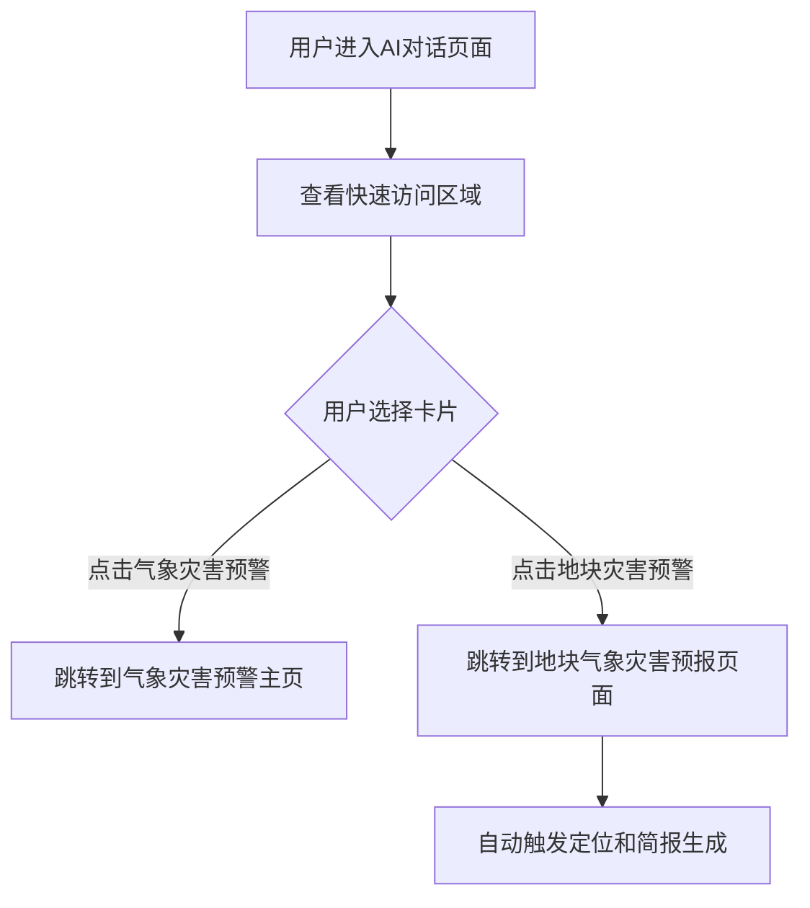

#### 3.1.5 业务规则

- 两个卡片样式统一，无特殊背景色
- 卡片点击后立即跳转，无需二次确认
- 地块灾害预警卡片点击后直接进入智能体对话流程

---

### 3.2 F002: 气象灾害预警主页（气象简报智能体入口）

#### 3.2.1 功能描述

气象简报智能体的入口页面，提供AI欢迎语、输入框、快速访问智能体入口，用户可在此页面开始与气象灾害预警AI专家对话。这是用户进入气象灾害预警功能的第一个页面，提供基础的对话入口和快速访问核心智能体的功能。

#### 3.2.2 交互设计

- **页面顶部**：返回按钮 + 标题"气象灾害预警"（居中显示）
- **右上角**：历史记录按钮（暂未实现，显示"即将推出"提示）
- **中间区域**：
  - AI Logo（云雨图标）
  - 欢迎语："您好，我是气象灾害预警专家，为您提供地块级精准气象预警和智能农事决策建议......"
  - "例子"按钮（灯泡图标）
- **输入区域**：多行文本输入框 + 语音按钮 + 相机按钮 + 发送按钮
- **底部**：快速访问区域，包含"气象预警简报"卡片

#### 3.2.3 业务逻辑

1. 用户进入气象灾害预警主页（气象简报智能体入口）
2. 可查看AI欢迎语和功能介绍
3. 可点击"例子"按钮查看常见问题示例
4. 可在输入框输入问题，点击发送或按Enter键提交（跳转到对话页面处理）
5. 可点击"气象预警简报"卡片快速进入地块气象灾害预报智能体（核心智能体）

#### 3.2.4 业务流程

**文字描述：**

用户进入气象灾害预警主页（气象简报智能体入口）后，可以查看AI欢迎语和功能介绍。用户可以点击"例子"按钮查看常见问题示例，或在输入框输入问题并发送（会跳转到对话页面处理）。用户也可以点击"气象预警简报"卡片快速进入地块气象灾害预报智能体（核心智能体）。

**流程图：**

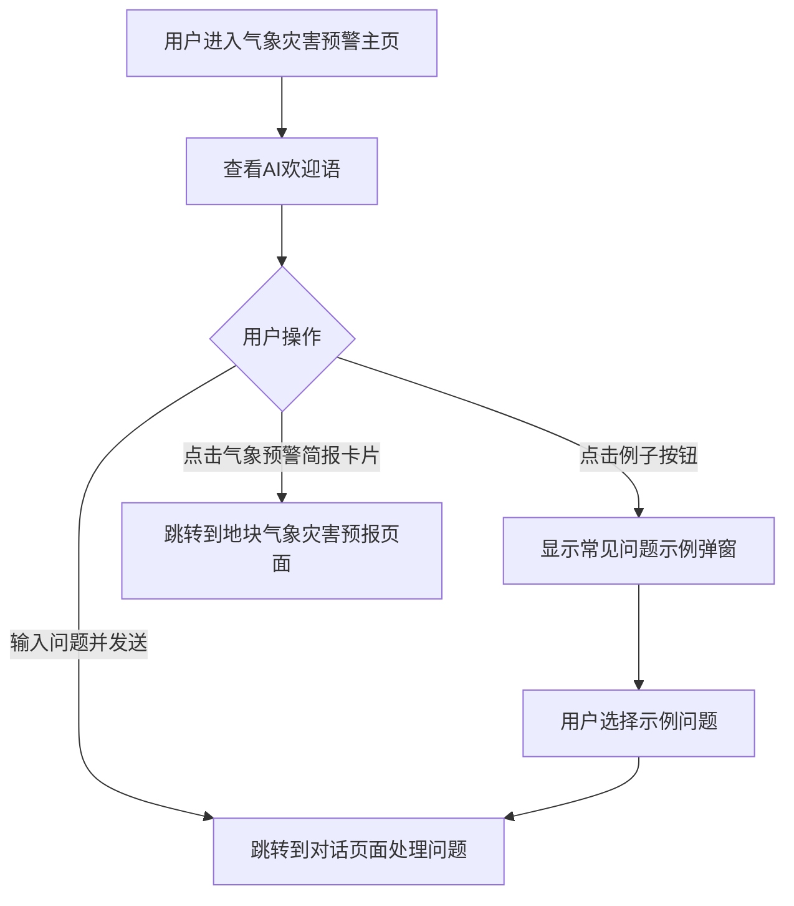

#### 3.2.5 业务规则

- 标题"气象灾害预警"居中显示
- 输入框支持多行文本输入
- 点击发送按钮或按Enter键均可提交问题
- 语音和相机功能暂未实现，点击显示"即将推出"提示

---

### 3.3 F003: 地块气象灾害预报智能体（核心智能体）

#### 3.3.1 功能描述

核心智能体页面，提供地块级精准气象预报服务。这是气象灾害预警功能的核心智能体，页面自动获取用户位置或支持手动选择地块，生成并展示气象简报卡片，同时支持用户通过对话继续追问相关问题。用户可以通过气象灾害预警主页的"气象预警简报"卡片快速进入此智能体。

#### 3.3.2 交互设计

- **页面顶部**：返回按钮 + 标题"地块气象灾害预报"（居中显示）
- **消息区域**：聊天式对话界面，显示AI和用户的消息
- **输入区域（固定在底部）**：
  - 定位按钮（发送位置）
  - 相机按钮（拍摄天象）
  - 文本输入框
  - 发送按钮

#### 3.3.3 业务逻辑

1. 用户进入地块气象灾害预报页面
2. 页面自动触发定位请求
3. 定位成功 → 自动匹配地块 → 生成气象简报卡片
4. 定位失败 → 提示用户授权或手动选择地块
5. 简报卡片展示后，显示快捷追问推荐
6. 用户可通过底部输入框继续提问
7. 系统识别用户意图，提供相应回复

#### 3.3.4 业务流程

**文字描述：**

用户进入地块气象灾害预报页面后，系统自动触发定位请求。如果定位成功，系统会获取经纬度坐标并匹配地块信息，然后生成气象简报卡片。如果定位失败，系统会提示用户授权或手动选择地块。简报卡片展示后，系统会显示快捷追问推荐。用户可以通过底部输入框继续提问，系统会识别用户意图并提供相应回复。

**流程图：**

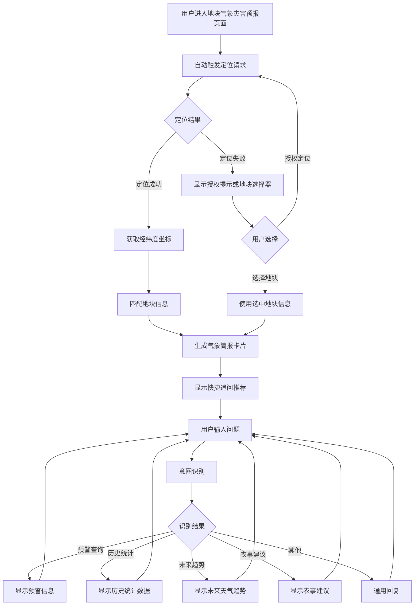

#### 3.3.5 业务规则

- 页面加载后自动触发定位，无需用户手动操作
- 定位超时时间：5秒
- 定位成功后自动生成简报，无需用户确认
- 输入框始终固定在页面底部，确保用户可随时提问
- 消息区域支持滚动，隐藏滚动条但保留滚动功能

---

### 3.4 F004: 位置获取与授权

#### 3.4.1 功能描述

通过浏览器GPS定位API获取用户当前位置，用于自动匹配地块。定位失败时，引导用户授权位置权限或提供手动选择地块的选项。

#### 3.4.2 交互设计

- **定位成功**：显示"已获取您的位置：纬度 XX，经度 XX。正在为您分析地块气象..."
- **定位失败**：显示提示消息和操作按钮
  - "📍 点击授权"按钮
  - "手动选择地块"按钮

#### 3.4.3 业务逻辑

1. 系统调用 `navigator.geolocation.getCurrentPosition()` API
2. 设置定位参数：超时5秒，启用高精度定位
3. 定位成功 → 获取经纬度坐标 → 传递给地块匹配逻辑
4. 定位失败 → 判断失败原因：
   - 用户拒绝授权 → 显示授权提示和手动选择选项
   - 定位超时 → 显示超时提示和手动选择选项
   - 设备不支持 → 直接显示地块选择器

#### 3.4.4 业务流程

**文字描述：**

系统触发定位请求后，调用GPS定位API。如果定位成功，系统会获取经纬度坐标并传递给地块匹配逻辑。如果定位失败，系统会根据失败原因（用户拒绝、定位超时、设备不支持）显示相应的提示和操作选项。用户可以选择授权定位或手动选择地块。

**流程图：**

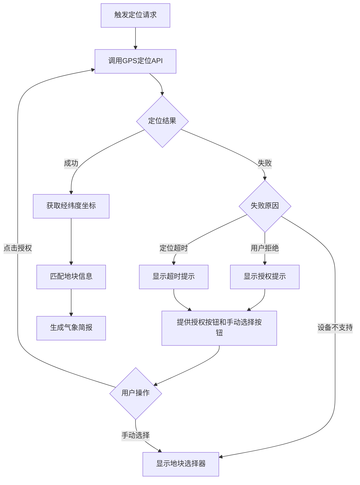

#### 3.4.5 业务规则

- 定位超时时间：5秒
- 启用高精度定位模式
- 定位失败时，必须提供手动选择地块的备选方案
- 用户授权后，自动重新尝试定位
- 定位信息仅用于匹配地块，不存储用户位置数据

---

### 3.5 F005: 地块选择功能

#### 3.5.1 功能描述

当定位失败或用户位置不在任何地块范围内时，提供地块列表供用户手动选择。每个地块显示名称、所属区域、种植作物、生长阶段等信息。

#### 3.5.2 交互设计

- 以消息气泡形式显示："以下是您可以查询的地块，请选择："
- 地块选项以可点击的标签形式展示，例如：
  - "柘城1号地块"
  - "柘城2号地块"
  - "柘城3号地块"

#### 3.5.3 业务逻辑

1. 系统检测到需要手动选择地块
2. 从地块数据源获取用户可访问的地块列表
3. 以消息气泡形式展示地块选项
4. 用户点击某个地块
5. 系统使用选中地块的信息（名称、区域、作物、生长阶段、坐标）生成气象简报

#### 3.5.4 业务流程

**文字描述：**

当系统检测到需要手动选择地块时，会从地块数据源获取用户可访问的地块列表，并以消息气泡形式展示。用户点击某个地块后，系统会使用选中地块的完整信息生成气象简报。

**流程图：**

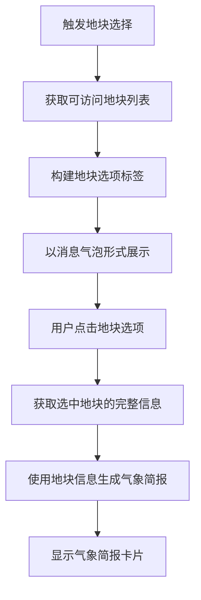

#### 3.5.5 业务规则

- 地块列表仅显示用户有权限访问的地块
- 每个地块必须包含：名称、所属区域、种植作物、生长阶段、地理坐标
- 用户选择地块后，立即生成该地块的气象简报
- 地块选择后，可继续通过对话切换其他地块

---

### 3.6 F006: 气象简报卡片展示

#### 3.6.1 功能描述

以卡片形式展示地块气象信息，包括红绿灯状态（适宜/警告/禁止）、地块基本信息、当前天气数据、预警信息、关联地块列表，以及"地块气象灾害预报"详情按钮。

#### 3.6.2 交互设计

- **卡片样式**：白色背景，圆角卡片，带阴影
- **顶部**：红绿灯状态图标 + 地块名称 + 作物信息
- **中间**：当前天气数据（温度、湿度、风力、天气状况），以图标+数值形式展示
- **预警区域**：如有预警，显示黄色警告条，包含预警类型和级别
- **关联地块**：列表形式展示，每个地块显示名称、作物、生长阶段
- **底部**：紫色按钮"地块气象灾害预报"，点击跳转到详情页

#### 3.6.3 业务逻辑

1. 系统获取地块信息和气象数据
2. 根据气象数据和作物生长阶段，计算红绿灯状态：
   - 适宜（绿色）：天气条件良好，适合农事作业
   - 警告（黄色）：有轻微风险，需注意
   - 禁止（红色）：存在严重风险，不建议作业
3. 整合当前天气数据（温度、湿度、风力、天气状况）
4. 检查是否有生效的预警信息
5. 查询关联地块信息
6. 渲染气象简报卡片

#### 3.6.4 业务流程

**文字描述：**

系统获取地块信息和气象数据后，会根据气象数据和作物生长阶段计算红绿灯状态。然后整合当前天气数据，检查预警信息，查询关联地块信息，最后渲染气象简报卡片。

**流程图：**

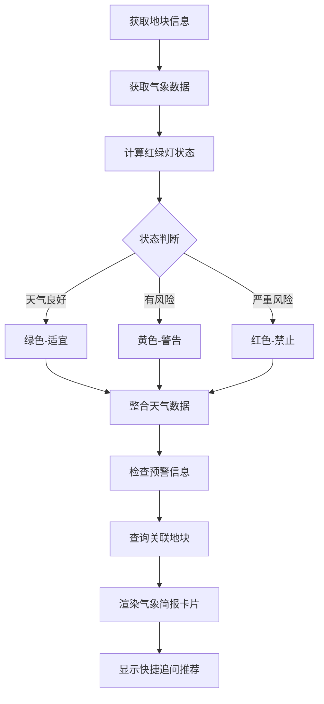

#### 3.6.5 业务规则

- 红绿灯状态基于气象数据和作物生长阶段综合判断
- 预警信息优先显示，如有多个预警，显示最高级别
- 关联地块显示同区域或同基地的其他地块
- 卡片数据实时更新，每次进入页面重新获取最新数据
- 点击"地块气象灾害预报"按钮跳转到详情页

---

### 3.7 F007: 气象详情页面

#### 3.7.1 功能描述

点击气象简报卡片中的"地块气象灾害预报"按钮，跳转到详情页，展示完整的气象分析报告，包括地块基本信息、当前天气详情、预警信息、关联地块列表、农事建议、更新时间等。

#### 3.7.2 交互设计

- **页面顶部**：返回按钮 + 标题"地块气象灾害分析报告" + 分享按钮
- **内容区域**：
  - 地块基本信息卡片（红绿灯状态、地块名称、作物信息）
  - 当前天气详情卡片（温度、湿度、风力、天气状况）
  - 预警信息卡片（如有）
  - 关联地块列表卡片
  - 农事建议卡片
  - 更新时间

#### 3.7.3 业务逻辑

1. 用户点击气象简报卡片中的"地块气象灾害预报"按钮
2. 跳转到气象详情页面
3. 页面加载地块的完整气象数据
4. 渲染各个信息卡片
5. 用户可点击分享按钮进行分享

#### 3.7.4 业务流程

**文字描述：**

用户点击气象简报卡片中的"地块气象灾害预报"按钮后，会跳转到气象详情页面。页面加载完整气象数据后，会依次渲染地块基本信息卡片、当前天气详情卡片、预警信息卡片（如有）、关联地块列表卡片、农事建议卡片，并显示更新时间。用户可点击分享按钮进行分享。

**流程图：**

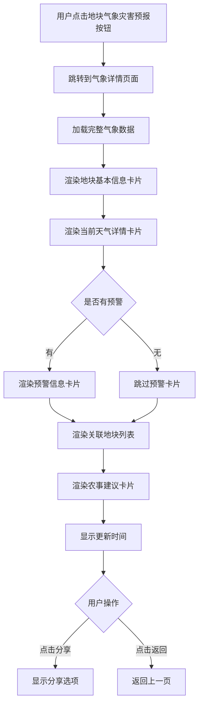

#### 3.7.5 业务规则

- 详情页数据与简报卡片数据保持一致
- 预警信息如有多个，全部展示
- 农事建议基于当前气象条件和作物生长阶段生成
- 更新时间显示数据最后更新时间
- 支持分享功能（见F008）

---

### 3.8 F008: 分享功能

#### 3.8.1 功能描述

支持将气象报告分享到微信好友、朋友圈、生成图片、复制链接等多种方式，方便用户将气象信息分享给他人。

#### 3.8.2 交互设计

- **触发入口**：气象详情页面右上角分享按钮
- **分享弹窗**：显示4个分享选项
  - 微信好友（微信图标）
  - 朋友圈（朋友圈图标）
  - 图片分享（图片图标）
  - 复制链接（链接图标）
- **图片预览弹窗**：生成分享图片后，弹出预览窗口，可保存图片

#### 3.8.3 业务逻辑

1. 用户点击分享按钮
2. 弹出分享选项弹窗
3. 用户选择分享方式：
   - **微信好友**：调用微信SDK，分享到微信好友
   - **朋友圈**：调用微信SDK，分享到朋友圈
   - **图片分享**：生成包含气象信息的图片，弹出预览窗口，用户可保存图片
   - **复制链接**：复制当前页面链接到剪贴板，显示复制成功提示

#### 3.8.4 业务流程

**文字描述：**

用户点击分享按钮后，会弹出分享选项弹窗。用户可以选择微信好友、朋友圈、图片分享或复制链接等分享方式。如果选择图片分享，系统会生成包含气象信息的图片并弹出预览窗口，用户可保存图片。如果选择复制链接，系统会复制链接到剪贴板并显示复制成功提示。

**流程图：**

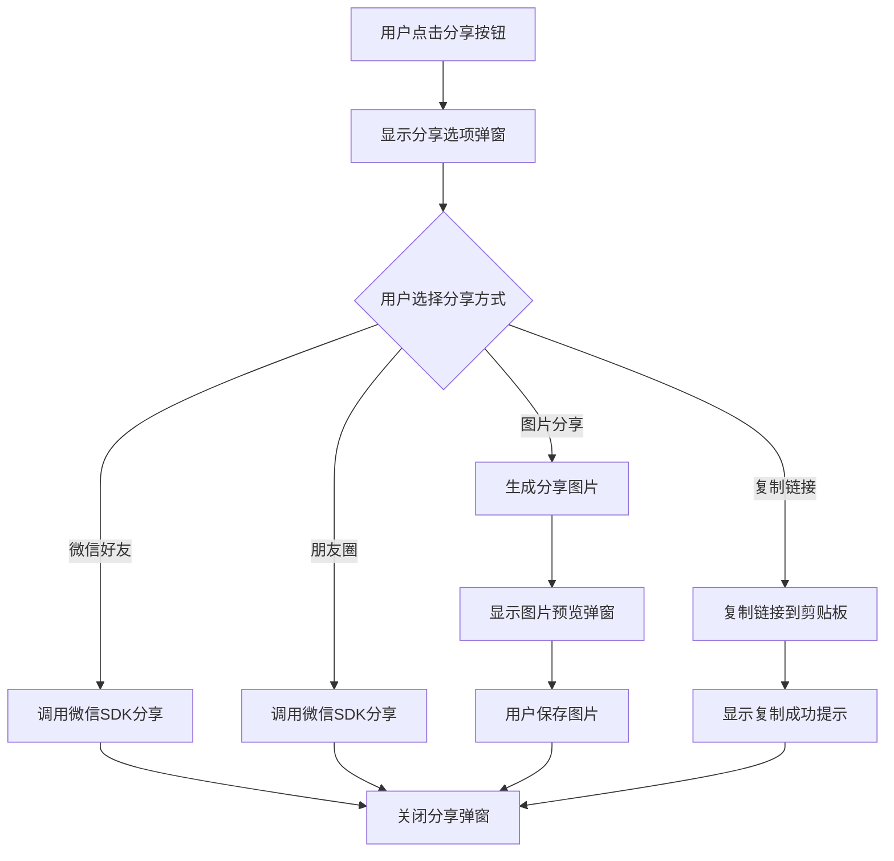

#### 3.8.5 业务规则

- 微信分享需要集成微信SDK，实际环境中需要配置
- 图片分享使用html2canvas库生成图片
- 分享图片包含：Logo、标题、地块信息、天气数据、预警信息、二维码、更新时间
- 复制链接成功后，显示明确的提示信息
- 所有分享方式操作完成后，自动关闭分享弹窗

---

### 3.9 F009: 智能对话交互

#### 3.9.1 功能描述

在气象简报展示后，保留底部输入框，支持用户继续追问气象相关问题。输入框固定在页面底部，始终可见，支持文本输入、定位发送、相机拍摄等功能。

#### 3.9.2 交互设计

- **输入框位置**：固定在页面底部
- **输入框组成**：
  - 定位按钮（左侧）
  - 相机按钮（左侧）
  - 文本输入框（中间，占满剩余空间）
  - 发送按钮（右侧，紫色渐变背景）
- **输入提示**："问我任何气象问题..."
- **支持Enter键发送**

#### 3.9.3 业务逻辑

1. 气象简报卡片展示后，输入框保持显示
2. 用户可在输入框输入问题
3. 用户可点击定位按钮发送当前位置
4. 用户可点击相机按钮拍摄天象照片（暂未实现）
5. 用户输入完成后，点击发送按钮或按Enter键提交
6. 系统处理用户问题，生成回复
7. 回复显示后，输入框清空，等待下一个问题

#### 3.9.4 业务流程

**文字描述：**

气象简报展示完成后，输入框保持显示。用户可以输入文本、点击定位按钮发送位置，或点击相机按钮拍摄照片。用户输入完成后，点击发送按钮或按Enter键提交。系统处理用户问题并生成回复，回复显示后，输入框清空，等待下一个问题。

**流程图：**

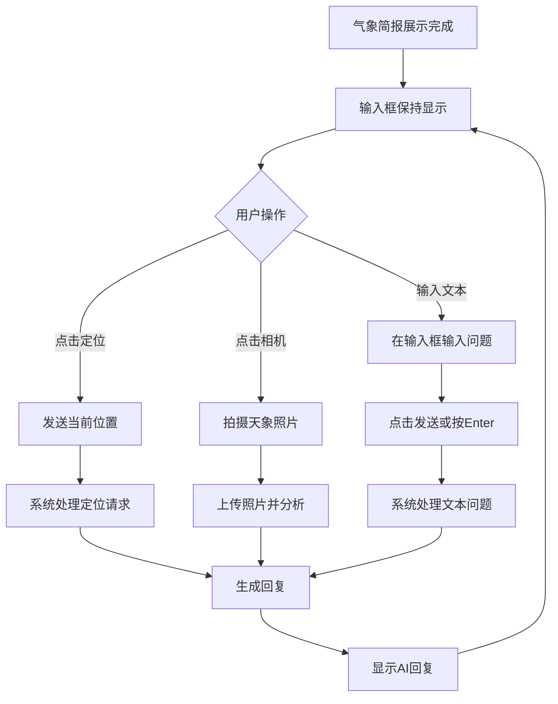

#### 3.9.5 业务规则

- 输入框始终固定在页面底部，不随内容滚动
- 输入框支持多行文本输入
- 空内容无法发送
- 发送后立即清空输入框
- 定位按钮点击后，重新触发定位和简报生成流程
- 相机功能暂未实现，点击显示"即将推出"提示

---

### 3.10 F010: 意图识别与智能回复

#### 3.10.1 功能描述

识别用户问题的意图，根据不同的意图类型提供相应的智能回复。支持的意图类型包括：预警查询、历史统计、未来趋势、农事建议、跨区域查询等。

#### 3.10.2 交互设计

- **用户消息**：显示在右侧，紫色气泡
- **AI回复**：显示在左侧，白色气泡，带AI头像
- **不同类型回复的展示形式**：
  - 预警查询：预警卡片
  - 历史统计：统计数据卡片
  - 未来趋势：趋势图表卡片
  - 农事建议：建议列表卡片
  - 其他：文本回复

#### 3.10.3 业务逻辑

1. 用户发送问题
2. 系统对问题进行意图识别（关键词匹配）：
   - 包含"预警"、"大风"、"下雨"、"暴雨" → 预警查询意图
   - 包含"历史"、"统计"、"记录"、"次数" → 历史统计意图
   - 包含"趋势"、"未来"、"7天" → 未来趋势意图
   - 包含"打药"、"农事"、"作业" → 农事建议意图
   - 包含其他区域名称 → 跨区域查询意图
   - 其他 → 通用回复
3. 根据识别结果，调用相应的处理函数
4. 生成并展示回复内容

#### 3.10.4 业务流程

**文字描述：**

用户发送问题后，系统会提取问题文本并进行意图识别（关键词匹配）。根据识别结果（预警查询、历史统计、未来趋势、农事建议、跨区域查询或其他），系统会调用相应的处理函数，生成并展示回复内容。

**流程图：**

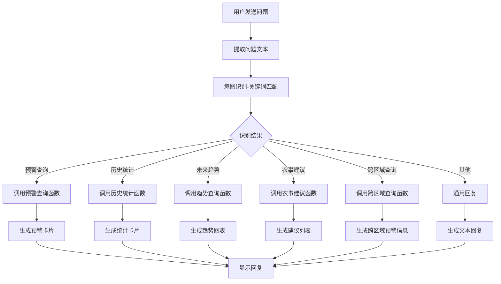

#### 3.10.5 业务规则

- 意图识别采用关键词匹配方式，后续可升级为NLP模型
- 多个关键词匹配时，按优先级选择意图（预警 > 历史 > 趋势 > 农事 > 其他）
- 回复内容基于当前地块信息和气象数据生成
- 跨区域查询时，需要明确指定区域名称
- 无法识别意图时，提供通用回复，引导用户重新提问

---

### 3.11 F011: 快捷追问推荐

#### 3.11.1 功能描述

在气象简报卡片展示后，以消息气泡形式显示"您还可以问我："提示，并提供4个快捷问题标签，用户点击即可快速提问。

#### 3.11.2 交互设计

- **提示文字**："您还可以问我："
- **快捷问题标签（灰色圆角标签，可点击）**：
  - "未来7天趋势？"
  - "最近有什么预警？"
  - "适合打药吗？"
  - "柘城县历史灾害统计"

#### 3.11.3 业务逻辑

1. 气象简报卡片展示完成后，延迟500ms显示快捷追问推荐
2. 以AI消息气泡形式展示提示文字和快捷问题标签
3. 用户点击任意快捷问题标签
4. 系统自动将该问题作为用户输入，触发意图识别和回复流程

#### 3.11.4 业务流程

**文字描述：**

气象简报卡片展示完成后，系统会延迟500ms显示快捷追问推荐。以AI消息气泡形式展示提示文字和问题标签。用户点击任意问题标签后，系统会自动将该问题作为用户输入，触发意图识别和回复流程。

**流程图：**

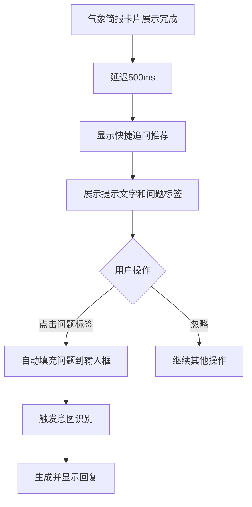

#### 3.11.5 业务规则

- 快捷问题推荐在简报卡片展示后自动显示
- 推荐的问题基于当前地块和气象情况生成
- 点击问题标签后，自动触发提问流程，无需用户再次确认
- 推荐问题数量：4个
- 问题文案简洁明了，便于用户理解

---

### 3.12 F012: 例子提示功能

#### 3.12.1 功能描述

在气象灾害预警主页提供"例子"按钮，点击后弹出常见问题示例弹窗，展示不同类型的问题示例，引导用户提问。

#### 3.12.2 交互设计

- **触发按钮**：主页中的"例子"按钮（灯泡图标 + "例子"文字）
- **弹窗样式**：居中弹窗，白色背景，圆角
- **弹窗内容**：
  - 标题："常见问题示例"
  - 关闭按钮（右上角X）
  - 问题示例列表，每个示例包含：
    - 问题分类（如"预警查询"）
    - 问题描述（如"柘城县未来7天天气如何？"）

#### 3.12.3 业务逻辑

1. 用户点击"例子"按钮
2. 弹出常见问题示例弹窗
3. 用户浏览问题示例
4. 用户点击某个示例问题
5. 自动填充到输入框并发送
6. 关闭弹窗，跳转到对话页面处理问题

#### 3.12.4 业务流程

**文字描述：**

用户点击"例子"按钮后，会弹出常见问题示例弹窗。用户浏览问题示例后，可以点击某个示例问题。系统会自动填充到输入框并发送，然后关闭弹窗，跳转到对话页面处理问题。

**流程图：**

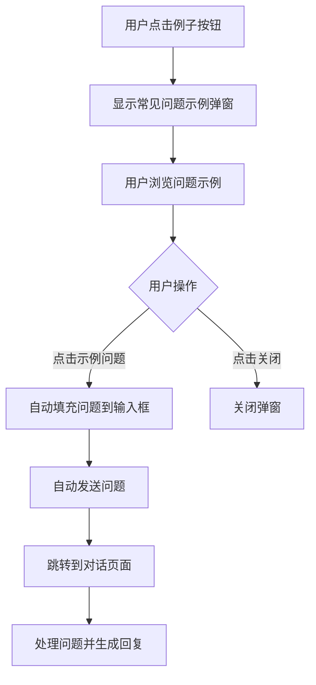

#### 3.12.5 业务规则

- 弹窗支持点击遮罩层关闭
- 示例问题按类别分组展示
- 点击示例问题后，自动填充并发送，无需用户再次确认
- 示例问题覆盖主要使用场景：预警查询、趋势查询、农事建议等

---

## 四、核心业务规则

### 4.1 定位与地块匹配规则

- **自动定位优先**：页面加载后自动触发GPS定位，无需用户手动操作
- **定位超时时间**：5秒，超时后提供手动选择选项
- **定位失败处理**：必须提供手动选择地块的备选方案，不能阻塞用户使用
- **地块匹配逻辑**：根据经纬度坐标匹配最近的地块，匹配失败时提供地块列表供选择

### 4.2 气象数据获取规则

- **数据实时性**：每次进入页面重新获取最新气象数据，不缓存
- **数据完整性**：必须包含温度、湿度、风力、天气状况、预警信息等完整数据
- **数据准确性**：气象数据来源于权威气象数据源，确保准确性

### 4.3 红绿灯状态判断规则

- **适宜（绿色）**：天气条件良好，无预警，适合农事作业
- **警告（黄色）**：有轻微风险或预警，需注意防范
- **禁止（红色）**：存在严重风险或高级别预警，不建议进行农事作业
- **判断依据**：综合气象数据、预警级别、作物生长阶段等因素

### 4.4 意图识别规则

- **关键词匹配优先级**：预警 > 历史统计 > 未来趋势 > 农事建议 > 其他
- **多关键词匹配**：按优先级选择意图类型
- **无法识别处理**：提供通用回复，引导用户重新提问或使用示例问题

### 4.5 对话交互规则

- **输入框固定**：输入框始终固定在页面底部，不随内容滚动
- **消息滚动**：消息区域支持滚动，隐藏滚动条但保留滚动功能
- **空内容限制**：空内容无法发送，需输入有效内容
- **发送后清空**：发送成功后立即清空输入框，准备下一个问题

### 4.6 分享功能规则

- **分享内容完整性**：分享内容必须包含完整的气象信息
- **分享方式多样性**：支持微信、朋友圈、图片、链接等多种分享方式
- **分享权限控制**：分享内容仅包含当前地块的气象信息，不包含用户个人信息

### 4.7 数据安全规则

- **位置隐私保护**：用户位置信息仅用于匹配地块，不存储，不分享
- **数据访问控制**：用户只能访问有权限的地块数据
- **数据更新频率**：气象数据实时更新，确保信息时效性

---

## 五、业务价值

### 5.1 提升预警及时性

- **价值描述**：通过地块级精准预警，帮助农户提前获知气象风险，及时采取防范措施
- **量化指标**：预警信息传递时间从传统方式的数小时缩短至实时推送
- **业务影响**：降低因气象灾害导致的农作物损失，预计可减少损失20-30%

### 5.2 优化农事决策

- **价值描述**：基于地块和作物的个性化农事建议，帮助农户在最佳时机进行农事作业
- **量化指标**：农事作业时机准确率提升至90%以上
- **业务影响**：提高农事作业效率，减少无效作业，节省成本10-15%

### 5.3 降低生产风险

- **价值描述**：通过红绿灯状态和预警信息，帮助农户规避高风险时段，降低生产风险
- **量化指标**：高风险时段作业率降低50%以上
- **业务影响**：减少因天气原因导致的作业失败和损失，提升生产稳定性

### 5.4 提升用户体验

- **价值描述**：一站式气象服务，无需切换多个平台，操作简便，信息精准
- **量化指标**：用户获取气象信息的时间从平均15分钟缩短至2分钟以内
- **业务影响**：提升用户满意度和平台粘性，预计用户活跃度提升30%

### 5.5 促进信息共享

- **价值描述**：通过分享功能，农户可将气象信息快速分享给合作伙伴、农技人员等
- **量化指标**：信息分享率提升，促进农业信息流通
- **业务影响**：增强农户之间的协作，提升整体农业管理水平

### 5.6 数据积累与优化

- **价值描述**：通过用户使用数据，不断优化预警模型和农事建议算法
- **量化指标**：积累大量地块级气象数据和用户反馈数据
- **业务影响**：持续提升服务精准度，形成数据驱动的服务优化闭环

---

## 附录

### A. 术语表

- **地块**：指具体的农田区域，包含名称、位置、作物、生长阶段等信息
- **红绿灯状态**：用于表示当前天气条件是否适合农事作业的三种状态（适宜/警告/禁止）
- **气象简报**：以卡片形式展示的地块气象信息汇总
- **智能体**：基于AI大模型的智能对话服务，可理解用户意图并提供相应服务

### B. 数据字段说明

- **地块信息**：名称、所属区域、种植作物、生长阶段、地理坐标
- **气象数据**：温度、湿度、风力、天气状况、预警信息
- **预警信息**：预警类型（暴雨、大风等）、预警级别（黄色、橙色、红色）、预警文本

### C. 后续扩展方向

1. **历史记录功能**：保存用户查询的气象记录，支持查看历史数据
2. **多地块管理**：支持用户管理多个地块，快速切换查看
3. **预警推送**：支持主动推送预警信息给用户
4. **专家咨询**：集成专家连线功能，提供更专业的农事建议
5. **数据可视化**：提供更丰富的图表和可视化展示

---

**文档版本**：v1.0  
**编写日期**：2025-01-XX  
**编写人**：产品团队  
**审核状态**：待审核
